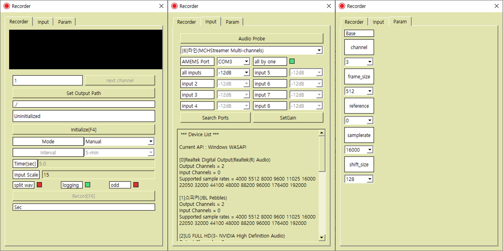

# Audio-Recorder

## Release
[v3.19 for Windows x64](https://drive.google.com/file/d/1c0j-6CEIId3ap8BVkgtD-DGBj0h3p_Gs/view?usp=sharing)      
[prerequsites](https://drive.google.com/drive/folders/1Lmk2U6LRkfHrNPbzh9A4GqUlnlBc-9yk?usp=sharing)      
[MEMS 및 녹음프로그램 메뉴얼](https://docs.google.com/document/d/1bU2l6bipMt-IezbR00lmAWUkCuw_twWNZXcia8pNJNI/edit?usp=sharing)  
   
## Status   
GUI : for Windows only, need to adjust.      

CLI : done
  
## Clone   
  
Need to clone recursively.  
```
git clone --recursive https://github.com/koobh/Audio-Recorder.git
```
If already clonded,  
```
git submodule init  
git submodule update
```  
  
## Build  
Use CMake.  

```
	 Audio_reocrder/<CLI or GUI>/build$ cmake ..  
```   
then, if you are in Ubuntu, there will be ```Makefile``` or if you are in Windows, there will be viusal stuidio project.   
  
## OS    
+ ubuntu 20.04 LTS : 64-bit   
+ Windows 10 : 64-bit  

## log  
+ wav plot displays properly, but output is all zero.  
=>  scale factor was too large (15e183) 
 
## Notice
|NAME|LICENSE|USEAGE|
|---|---|---|
[Qt6Framework](https://www.qt.io)|[LGPL](https://www.qt.io/terms-conditions/)|GUI, text encoding   
[json](https://github.com/nlohmann/json)|[MIT](https://github.com/nlohmann/json/blob/develop/LICENSE.MIT)| configuration management     
[RtAudio](https://www.music.mcgill.ca/~gary/rtaudio/) |[license](https://www.music.mcgill.ca/~gary/rtaudio/license.html)| recording     
[serial](https://github.com/wjwwood/serial)|[license](https://github.com/wjwwood/serial#license)| AMEMS gain control  
