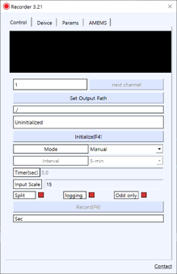

# Audio-Recorder

Audio recorder for multi-channel mic array.  

[Latest version for Windows x64](https://drive.google.com/file/d/1Y4RpUYlp_b_RwfSBZGkKZ2jWyXNnGY2B/view?usp=sharing
)      
  

## Resources
[prerequsites for miniDSP mic array](https://drive.google.com/drive/folders/1Lmk2U6LRkfHrNPbzh9A4GqUlnlBc-9yk?usp=sharing)      
[MEMS 및 녹음프로그램 메뉴얼](https://docs.google.com/document/d/1bU2l6bipMt-IezbR00lmAWUkCuw_twWNZXcia8pNJNI/edit?usp=sharing)  
 
## Notice
|NAME|LICENSE|USEAGE|
|---|---|---|
[Qt6Framework](https://www.qt.io)|[LGPL](https://www.qt.io/terms-conditions/)|GUI, text encoding   
[json](https://github.com/nlohmann/json)|[MIT](https://github.com/nlohmann/json/blob/develop/LICENSE.MIT)| configuration management     
[RtAudio](https://www.music.mcgill.ca/~gary/rtaudio/) |[license](https://www.music.mcgill.ca/~gary/rtaudio/license.html)| recording     
[serial](https://github.com/wjwwood/serial)|[license](https://github.com/wjwwood/serial#license)| AMEMS gain control  
